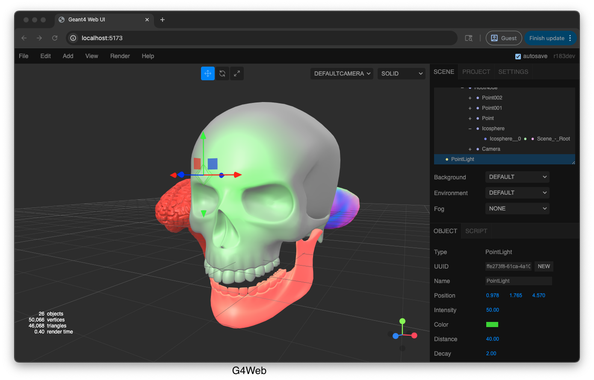

# g4web

[](https://github.com/jintonic/g4web/actions/workflows/deploy.yml)
[](LICENSE)

**g4web** is a browser-based graphical user interface for defining detector geometry for [Geant4](https://geant4.web.cern.ch)-based particle physics simulations. It is built on top of the official [Three.js Editor](https://threejs.org/editor/) and extends it with Geant4-specific solid geometries, material assignment, and geometry export to the Text-based Geometry (TG) format accepted by [GEARS](https://github.com/jintonic/gears).

A live demo is available at **https://jintonic.github.io/g4web/**.

---

## Table of Contents

- [What does g4web do?](#what-does-g4web-do)
- [Who is it for?](#who-is-it-for)
- [Features](#features)
- [Installation](#installation)
  - [Prerequisites](#prerequisites)
  - [Steps](#steps)
  - [Troubleshooting](#troubleshooting)
- [Development Setup](#development-setup)
- [Usage](#usage)
  - [Adding a Solid](#adding-a-solid)
  - [Selecting and Moving Objects](#selecting-and-moving-objects)
  - [Editing Geometry Parameters](#editing-geometry-parameters)
  - [Assigning a Geant4 Material](#assigning-a-geant4-material)
  - [Inspecting the Geometry](#inspecting-the-geometry)
  - [Saving the Scene](#saving-the-scene)
  - [Exporting for Geant4](#exporting-for-geant4)
  - [Importing Geometry](#importing-geometry)
  - [Keyboard Shortcuts](#keyboard-shortcuts)
- [Verification](#verification)
- [Screenshots](#screenshots)
- [Citation](#citation)
- [Contributing](#contributing)
- [License](#license)

---

## What does g4web do?

g4web provides a point-and-click interface for constructing Geant4 detector geometries without writing any C++ or macro code. Users can:

- Place and configure Geant4 solid shapes (Box, Tube, Sphere, Cone, Torus, and more) in a 3D viewport.
- Assign Geant4 NIST materials (including elements, compounds, HEP/nuclear materials, space materials, and bio-chemical materials) to volumes.
- Inspect the detector geometry interactively in the browser.
- Export the geometry to `.tg` (Text-based Geometry) and `.mac` (Geant4 macro) files for use with Geant4-based simulation tools such as [GEARS](https://github.com/jintonic/gears).

---

## Who is it for?

g4web is designed for:

- **Experimental physicists** who need to prototype detector geometries quickly without deep C++ expertise.
- **Nuclear and particle physics students** learning Geant4 simulation for the first time.
- **Educators** teaching detector simulation in courses or workshops.
- **Researchers** who use Geant4-based tools (e.g., GEARS) and want a visual geometry editor.

---

## Features

- 20+ Geant4 solid types: `G4Box`, `G4Tubs`, `G4Cons`, `G4Sphere`, `G4Torus`, `G4Para`, `G4Trd`, `G4Trap`, `G4Polycone`, `G4Polyhedra`, `G4Ellipsoid`, twisted solids, and more.
- Full [NIST material database](https://geant4-userdoc.web.cern.ch/UsersGuides/ForApplicationDeveloper/html/Appendix/materialNames.html) browsable by category (elements, NIST compounds, HEP & nuclear, space, bio-chemical).
- Export to `.tg` (Text-based Geometry) and `.mac` (Geant4 run macro) formats.
- Auto-save of the scene to browser local storage.
- File drag-and-drop import.
- Non-destructive customization pattern — vendor (Three.js) files are never modified.
- Deployed automatically to GitHub Pages on every push to `main`.

---

## Installation

### Prerequisites

| Requirement | Minimum version | Notes                             |
| ----------- | --------------- | --------------------------------- |
| Node.js     | 18.x            | [nodejs.org](https://nodejs.org/) |
| npm         | 9.x             | Bundled with Node.js              |
| Git         | 2.x             | Must support `git submodule`      |

### Steps

```bash
# 1. Clone the repository and its Three.js submodule
git clone --recursive https://github.com/jintonic/g4web.git
cd g4web

# 2. Install dependencies
npm install
```

> **Note:** The `--recursive` flag is required because Three.js is included as a
> Git submodule under `vendor/threejs/`. If you already cloned without it, run:
> `git submodule update --init --recursive`

### Troubleshooting

- **`git submodule` errors after cloning** — run `git submodule update --init --recursive` to populate `vendor/threejs/`.
- **Port already in use** — Vite will pick the next available port; check the terminal output for the actual URL.
- **`npm install` fails on Node.js < 18** — upgrade Node.js. Using [nvm](https://github.com/nvm-sh/nvm) is recommended (`nvm install 20 && nvm use 20`).

---

## Development Setup

```bash
# Start the Vite development server with hot-reload
npm run dev
```

Open your browser at `http://localhost:5173` (or the port printed in the terminal).

To build a production bundle:

```bash
npm run build
# Preview the built site locally
npm run preview
```

See [CONTRIBUTING.md](CONTRIBUTING.md) for the project's non-destructive customization approach before making UI changes.

---

## Usage

g4web presents a 3D viewport in the centre of the screen, a **left panel** of Geant4 solid shapes, and a **right sidebar** with _Object_, _Geometry_, and _Material_ tabs for configuration.

### Adding a Solid

Click any shape icon in the **left panel** to place it in the 3D scene. Available shapes include:

| Icon group  | Geant4 solid types                                       |
| ----------- | -------------------------------------------------------- |
| Primitives  | G4Box, G4Tubs, G4Cons, G4Sphere, G4Torus                 |
| Polyhedral  | G4Para, G4Trd, G4Trap, G4Trap4                           |
| Curvilinear | G4Ellipsoid, G4EllipticalTube, G4EllipticalCone, G4Hype  |
| Polysurface | G4Polycone, G4Polyhedra, G4Tet                           |
| Twisted     | G4TwistedBox, G4TwistedTrd, G4TwistedTrap, G4TwistedTubs |

You can also drag a shape icon into the viewport to place the solid at the cursor position.

### Selecting and Moving Objects

- **Left-click** an object in the viewport to select it.
- Use the **transform gizmo** (top-left toolbar) to translate or rotate.
- Numeric values can also be edited directly in the _Object_ tab of the sidebar.

### Editing Geometry Parameters

1. Select an object in the viewport.
2. Open the **Geometry** tab in the right sidebar.
3. Adjust the dimension parameters (e.g., half-lengths, radii, angles).

Parameters correspond 1-to-1 to Geant4 constructor arguments. Units are in **centimetres** for lengths and **degrees** for angles.

### Assigning a Geant4 Material

1. Select an object in the viewport.
2. Open the **Material** tab in the right sidebar.
3. Choose a **Category**:
   - _Elements (Periodic Table)_ — pure elements, e.g. `G4_H`, `G4_Fe`
   - _NIST Compounds_ — pre-defined NIST materials, e.g. `G4_WATER`, `G4_AIR`
   - _HEP & Nuclear_ — detector-specific materials, e.g. `G4_lH2`, `G4_lN2`
   - _Space Materials_ — e.g. `G4_KEVLAR`
   - _Bio-Chemical_ — e.g. `G4_CYTOSINE`
4. Select the desired **material** from the drop-down list.

The selected material is stored in `object.userData.g4Material` and serialised with the scene.

### Inspecting the Geometry

- **Orbit**: left-click and drag.
- **Zoom**: scroll wheel.
- **Pan**: right-click and drag (or middle-click and drag).
- Use the **View** menu to toggle helpers (grid, axes, etc.).

### Saving the Scene

The scene is **auto-saved** to browser local storage as you work. To save it as a JSON file for backup or sharing, use **File → Export → Scene (JSON)** from the menubar.

### Exporting for Geant4

g4web can export the scene to two files:

- **`detector.tg`** — A human-readable Text-based Geometry description accepted by [GEARS](https://github.com/jintonic/gears) and other tools that support the Geant4 text geometry reader.
- **`run.mac`** — A starter Geant4 macro that initialises the geometry, configures a 2.6 MeV isotropic gamma-ray source, and runs 100 events.

To export:

1. Click **File → Export → TG** in the menubar.
2. A preview panel shows both the `.tg` and `.mac` content.
3. Use the **download** buttons to save the files to your computer.

For details on the `.tg` format, supported solids, units convention, and current limitations (e.g. CSG boolean operations are not yet exported), see [docs/geometry-export.md](docs/geometry-export.md).

### Importing Geometry

Drag and drop a previously exported `.json` scene file, or a supported 3D file (OBJ, STL, GLTF), onto the viewport to import it.

### Keyboard Shortcuts

| Key            | Action                 |
| -------------- | ---------------------- |
| `W`            | Move (translate) mode  |
| `E`            | Rotate mode            |
| `R`            | Scale mode             |
| `Del`          | Delete selected object |
| `Ctrl+Z`       | Undo                   |
| `Ctrl+Shift+Z` | Redo                   |
| `Ctrl+S`       | Save to local storage  |

---

## Verification

Run the following commands to check code formatting and execute package-level tests:

```bash
# Check code formatting (Prettier)
npm run format:check

# Run tests for all workspace packages (geant4-csg)
npm test

# Verify the production build compiles without errors
npm run build
```

See [docs/verification.md](docs/verification.md) for details on what each check covers.

---

## Screenshots



A screenshot of the g4web user interface showing the 3D viewport, left solid palette, and Geant4 material selection panel.

---

## Citation

If you use g4web in research that leads to a publication, please cite:

```bibtex
@article{g4web_joss,
  author  = {Liu, Jing},
  title   = {g4web: A web-based user interface for Geant4 detector definition},
  journal = {Journal of Open Source Software},
  year    = {2026},
  note    = {(submitted)}
}
```

See [CITATION.cff](CITATION.cff) for machine-readable citation metadata.

---

## Contributing

Contributions are welcome! Please read [CONTRIBUTING.md](CONTRIBUTING.md) first — this project uses a non-destructive customization pattern to keep vendor (Three.js) files pristine.

For bug reports and feature requests, use the [GitHub issue tracker](https://github.com/jintonic/g4web/issues).

---

## License

g4web is licensed under the [GNU Affero General Public License v3.0](LICENSE) (AGPL-3.0).

The bundled Three.js editor (`vendor/threejs/`) is licensed under the [MIT License](vendor/threejs/LICENSE).
